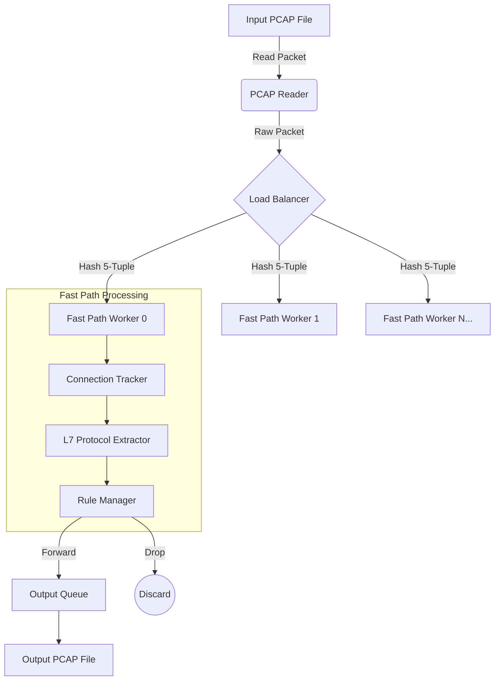

<div align="center">

# 🛡️ PyDPI-Engine

**A High-Performance, Pure-Python Deep Packet Inspection (DPI) & Traffic Analysis Engine**

[](https://www.python.org/downloads/)
[](#)
[](#)
[](https://opensource.org/licenses/MIT)

*Analyze, classify, and filter network traffic in real-time without relying on external C-libraries.*

---

</div>

## 📖 Overview

**PyDPI-Engine** is a fully standalone Python implementation of a Deep Packet Inspection system. Originally ported from a high-throughput C++ codebase, this engine brings stateful connection tracking, L7 protocol extraction, and automated traffic blocking to Python environments **without requiring `libpcap`, `Scapy`, or any external C-extensions.**

It is designed for speed and portability, utilizing advanced Python optimizations (`__slots__`, pre-compiled structs, binary memory views) and a multi-threaded producer-consumer architecture to process packets efficiently.

---

## ✨ Key Features

- **🚀 Zero Dependencies:** Runs entirely on the Python Standard Library. No external packages needed.
- **🧵 Multi-Threaded Architecture:** Utilizes a scalable Load Balancer and Fast Path worker model to maximize throughput.
- **🧠 Stateful Inspection:** Maintains complete TCP state machines and 5-tuple connection history.
- **🔍 L7 Traffic Classification:** Extracts and parses:
  - **TLS/SSL:** Server Name Indication (SNI) from Client Hello.
  - **HTTP:** Host headers.
  - **DNS:** Query domain names.
  - **QUIC:** Initial packet inspection.
- **⛔ Rule-Based Filtering:** Dynamically block traffic based on IP, Port, specific Domains (with wildcard support `*.example.com`), or Application Types (e.g., YouTube, Netflix, Discord).
- **📊 Comprehensive Reporting:** Generates detailed statistics on packet drops, load balancer distribution, and application traffic profiling.

---

## 🏗️ System Architecture

The engine uses a highly concurrent pipeline to process packets:



---

## ⚙️ Installation

Getting started is trivial since there are no external requirements:

```bash
# Clone the repository
git clone https://github.com/Skandamrao/PyDPI-Engine-Optimized.git
cd PyDPI-Engine-Optimized

# You're ready to go!
```

---

## 🚀 Usage

The project provides two primary tools: a simple packet analyzer and the full multi-threaded DPI engine.

### 1. Basic Packet Analyzer
Parse and display the contents of a PCAP file in a human-readable format.

```bash
# Analyze all packets
python packet_analyzer.py sample.pcap

# Analyze only the first 10 packets
python packet_analyzer.py sample.pcap 10
```

### 2. Full DPI Engine & Traffic Filter
Run the DPI engine to classify traffic and apply filtering rules, outputting the allowed packets to a new file.

**Block Specific Applications:**
```bash
python -X utf8 dpi_main.py input.pcap filtered.pcap --block-app YouTube --block-app Instagram
```

**Block Specific Domains (with wildcards):**
```bash
python -X utf8 dpi_main.py input.pcap filtered.pcap --block-domain "*.tiktok.com"
```

**Block by Source/Destination IP:**
```bash
python -X utf8 dpi_main.py input.pcap filtered.pcap --block-ip 192.168.1.50
```

**Load Complex Rules from a File:**
```bash
python -X utf8 dpi_main.py input.pcap filtered.pcap --rules blocking_rules.txt
```

> **Note on Windows:** Use the `-X utf8` flag to ensure the CLI dashboard's box-drawing characters render correctly in PowerShell/CMD.

---

## ⚡ Performance Optimizations

To bridge the performance gap between C++ and Python, this engine implements several low-level optimizations:
- **Pre-compiled `struct` Objects:** Avoids the overhead of parsing format strings on every packet.
- **Memory Efficiency:** Strict use of `__slots__` on hot-path data classes (e.g., `ParsedPacket`, `Connection`) reduces memory footprint and speeds up attribute access.
- **Fast Lookups:** Uses pre-built dictionaries and sets for protocol identification and rule matching instead of `if/elif` chains.
- **Native Bytes Manipulation:** Employs `bytes.hex()` and memory slicing to avoid slow Python loops when parsing MAC addresses and payloads.

---

## 📜 Supported Applications for Blocking

The engine can natively identify and block the following applications via SNI/Host extraction:

`Google`, `YouTube`, `Facebook`, `Instagram`, `Twitter/X`, `Netflix`, `Amazon`, `Microsoft`, `Apple`, `WhatsApp`, `Telegram`, `TikTok`, `Spotify`, `Zoom`, `Discord`, `GitHub`, `Cloudflare`.

---

## 🗺️ Roadmap

- [ ] **IPv6 Support:** Full parsing and rule matching for IPv6 addresses.
- [ ] **Extended L7 Parsers:** Add extraction for additional protocols like SMTP, FTP, and deeper QUIC inspection.
- [ ] **Regex Rule Matching:** Allow complex regex-based rules for domains and SNIs.
- [ ] **Multiprocessing Support:** Bypass the Global Interpreter Lock (GIL) by porting the Fast Path workers from threads to separate processes for true parallel execution on multi-core CPUs.

---

## ⚠️ Disclaimer

This tool is designed for educational purposes, network diagnostics, and legitimate traffic management. Please ensure you have explicit permission to capture and inspect network traffic on any network where this software is deployed.

---

<div align="center">
<i>Built with 💻 for high-performance network analysis.</i>
</div>